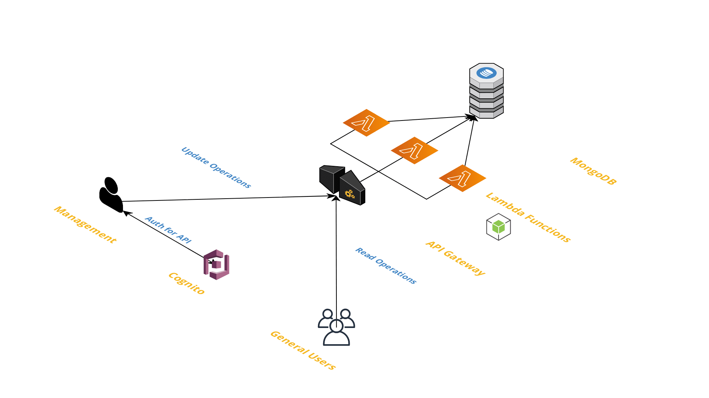
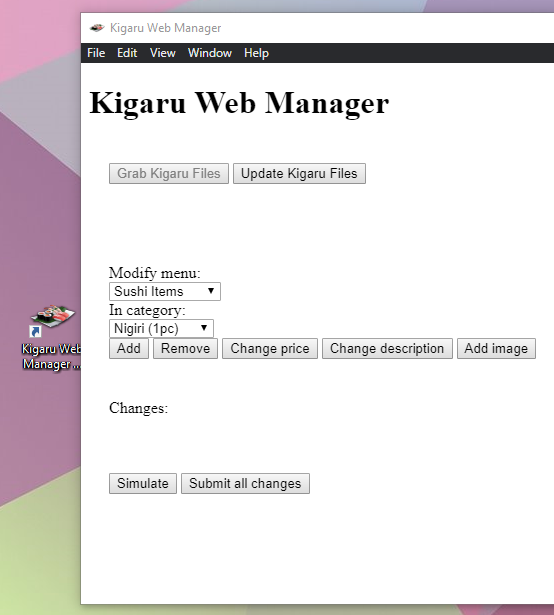
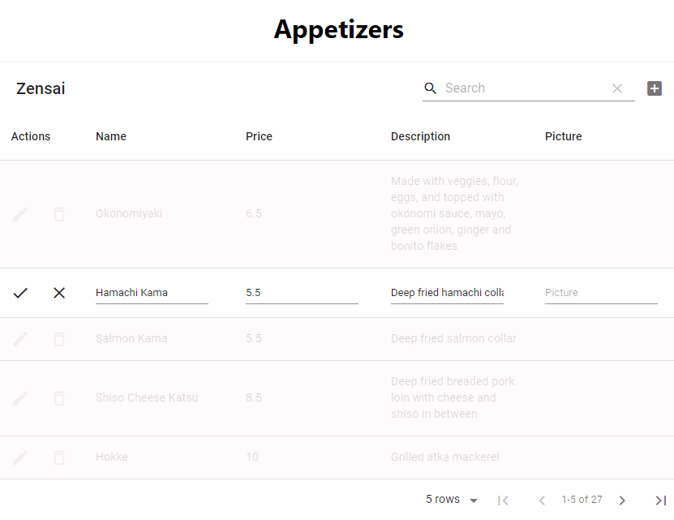

This web application is published at kigaru-sushi.com/manager (using a reference) and was developed as a replacement for previous [management application](https://github.com/mark-huynh/kigaruwebmanager) which is now deprecated.

## Introduction
The Kigaru management application was created to allow for management of the Kigaru Sushi establishment to be able to perform creating, updating, and deleting operations on the items on the [Kigaru Sushi](kigaru-sushi.com) website at this [repo](https://github.com/mark-huynh/kigaruweb).

## Intergration Summary
Using REST AWS API endpoints that I have developed, along with AWS Cognito for authorization for those endpoints, authorized users may modify data that is dynamically fetched on the Kigaru website. The data currently lies in a MongoDB database, where AWS Lambda functions perform the CRUD (Create, Read, Update, Delete) operations. 

Users that are registered with AWS Cognito are able to perform modifications to the MongoDB database via POST requests. Upon login, Cognito will provide a authorization that becomes attached to request headers. This authorization is not necessary to perform GET requests from the same endpoint. Here is the architecture:

## Why I updated the manager

In the past, all the data on the website was completely static and any changes that wanted to be made had to be done through Git. The deprecated management repo was simply a GUI that ran file parsing and git scripts. 

Old application:

Drawbacks to old:
- Required the installation of my Electron application
- Python scripts simply parsed the existed files and pushed it to production. Was extremely unstable for long term use
- Required management to have a Github account, introducing a lot of overhead
- Could not be handed off to new managers/employees easily

## New Web Application Overview

The new web application is now completely online and thus can be accessed anywhere without needing to download dependencies. It can be handed off to new employees easily as it only requires login credentials. After logging in, the UI will change to allow for changes to be made. Any changes automatically become submitted and new data becomes fetched in the background to update the tables. Instructions are labeled at the top of the page and an example of editing a row looks like this:

**Updated March 2020**